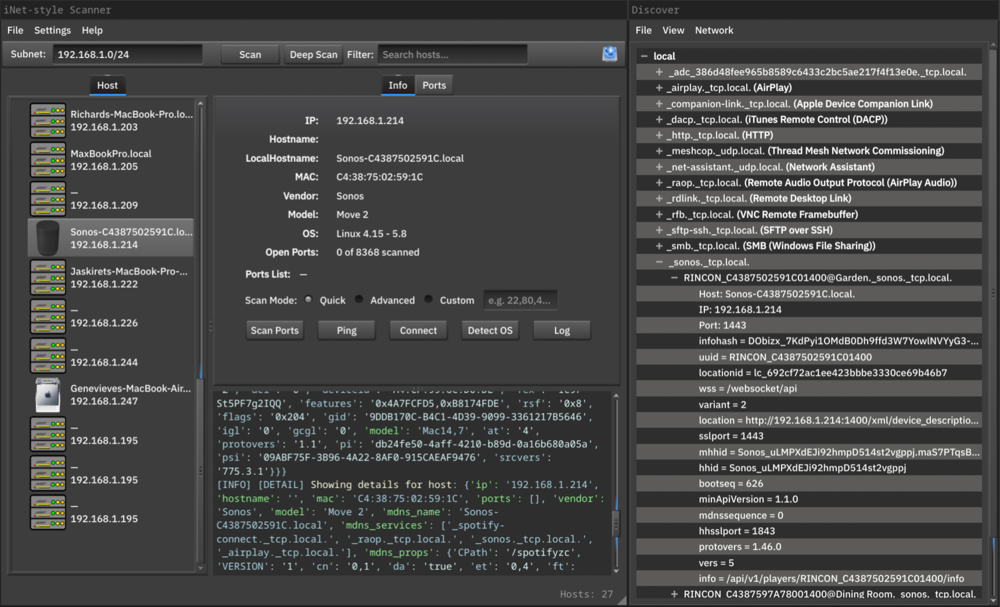

# iNetScan



**iNetScan** is a graphical network scanner inspired by macOS iNet. It performs fast and intelligent host discovery on local subnets, showing detailed metadata, icons, and service info for each device it finds.

## Features

- ⚡ Fast subnet scans using RustScan and Nmap  
- 🌐 Bonjour/mDNS discovery with metadata merge  
- ☎️ Vendor and model detection via MAC and mDNS  
- 💻 Smart icon assignment based on model/vendor/hostname  
- 🕵🏼‍♂️ OS detection per-host (via Nmap)  
- 🔌 Click-to-connect: SSH, HTTP, SMB, VNC, RDP, Webmin  
- 📦 Export to JSON, CSV, or Excel  
- 📝 Live color-coded log output  
- 💈 Qt6 GUI with real-time scan feedback and progress bar  
- 🧪 Per-host port scan with selectable modes (Quick / Advanced / Custom)  

## Recent Changes

- **Toggleable Stop Buttons:** Both **Scan** and **Deep Scan** buttons now switch to “Stop” while a scan is running, and reliably revert to “Scan”/“Deep Scan” once the scan (including mDNS resolution) completes or is cancelled.
- **Unified Multi-Phase Progress Bar:** Scans now use a segmented progress animation with two distinct phases: host discovery and mDNS resolution — ensuring the bar progresses smoothly and never stalls.
- **UI Unblock:** The mDNS worker always emits a `mdns_done` signal, ensuring the spinner and progress bar are stopped cleanly at the end of scanning.
- **mDNS Signals:** The mDNS worker now emits both `mdns_done` (on completion) and `host_found` (for partial updates), enabling consistent and incremental UI updates.
- **Per-Host Scan Progress:** A new progress indicator and disabled state are shown when scanning ports for individual hosts, providing clear visual feedback per scan.
- **System Tray Notifications:[NOT YET WORKING]** <s>Critical errors (e.g. scan failure) now optionally will trigger a desktop notification via the system tray icon.</s>
- **Updated Status Bar Font:** The status bar uses the platform’s default sans-serif font with a muted style for consistency.


## Disclaimer

> **This is a work-in-progress app.**  
> iNetScan is under active development and is not yet considered a mature or production-grade tool and it may never be. You may encounter bugs, missing features, or visual quirks and stupid mistakes.  
> Feedback, ideas, and pull requests are welcome!

## How to use

### FreeBSD

Install dependencies:

```sh
pkg install py311-qt6-pyqt nmap rustscan py311-pandas py311-manuf
```

Then:

```sh
git clone https://github.com/YOUR_USERNAME/inet-scan.git
cd inet-scan
python3 inetscan.py
```
### macOS (via Homebrew)

Install dependencies:

brew install nmap rustscan python3

### Option 1: Recommended — use a virtual environment
```
python3 -m venv venv
source venv/bin/activate
pip install PyQt6 pandas manuf zeroconf
```
### Option 2: Install globally (not recommended)
```
pip3 install PyQt6 pandas manuf zeroconf --break-system-packages
```

Then:

```sh
git clone https://github.com/YOUR_USERNAME/inet-scan.git
cd inet-scan
python3 inetscan.py
```

## ⚙️ Configuring Nmap and RustScan Paths

By default, iNetScan attempts to auto-detect `nmap` and `rustscan` using your system’s PATH.

If your tools are installed in non-standard locations or not detected correctly:

1. Launch iNetScan.
2. From the menu bar, choose **Settings → Settings...**
3. Set the full path to the `nmap` and `rustscan` binaries (e.g., `/usr/local/bin/nmap` or `/opt/homebrew/bin/rustscan`).
4. Click **OK** to save and continue.

Settings are saved persistently between runs using `QSettings`.

## Optional Data Files

These optional JSON files enhance vendor/model/icon accuracy:

- `oui_extra.json`, `mac_overrides.json` – Extra MAC vendor mappings  
- `apple_models.json` – Apple MAC prefixes → product models  
- `mdns_models.json` – mDNS model → icon mapping  
- `icon_map.json` – Override final icon file name  

Place icons in: `icons/png/` or `icons/svg/`

## Export Formats

- `.json`, `.csv`, `.xlsx` (requires `pandas`)

## License

MIT © 2025 iNetScan Contributors
